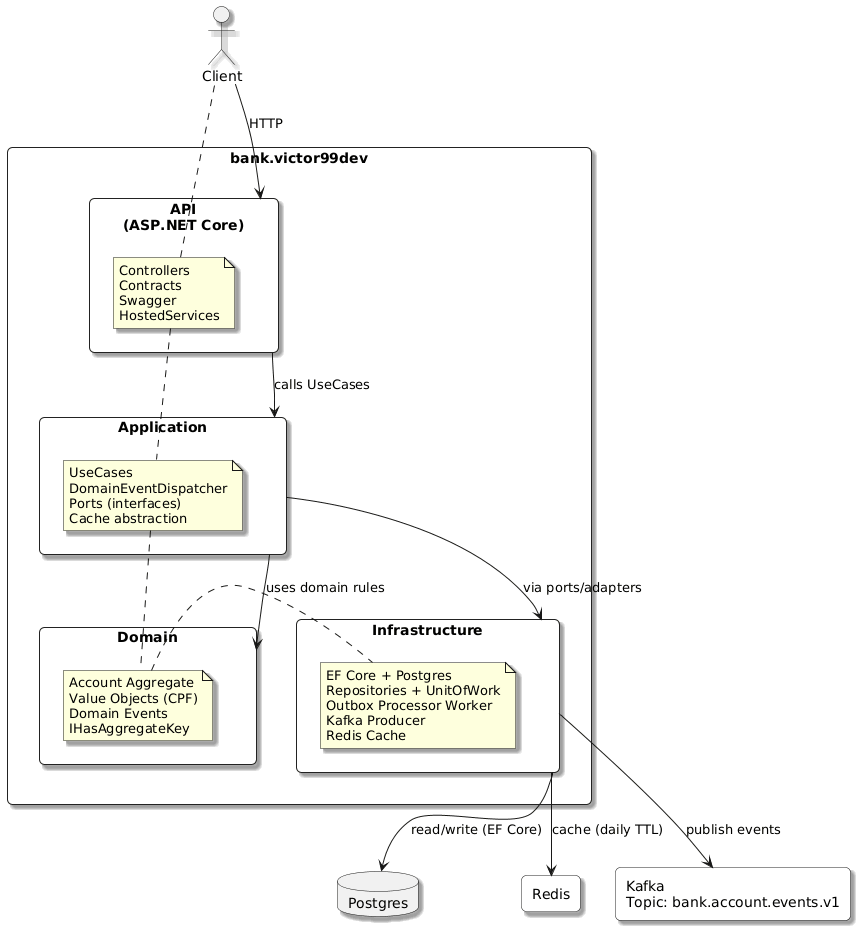
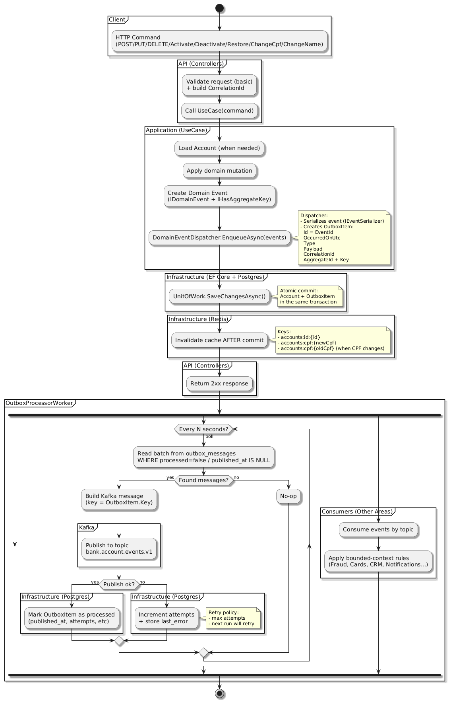
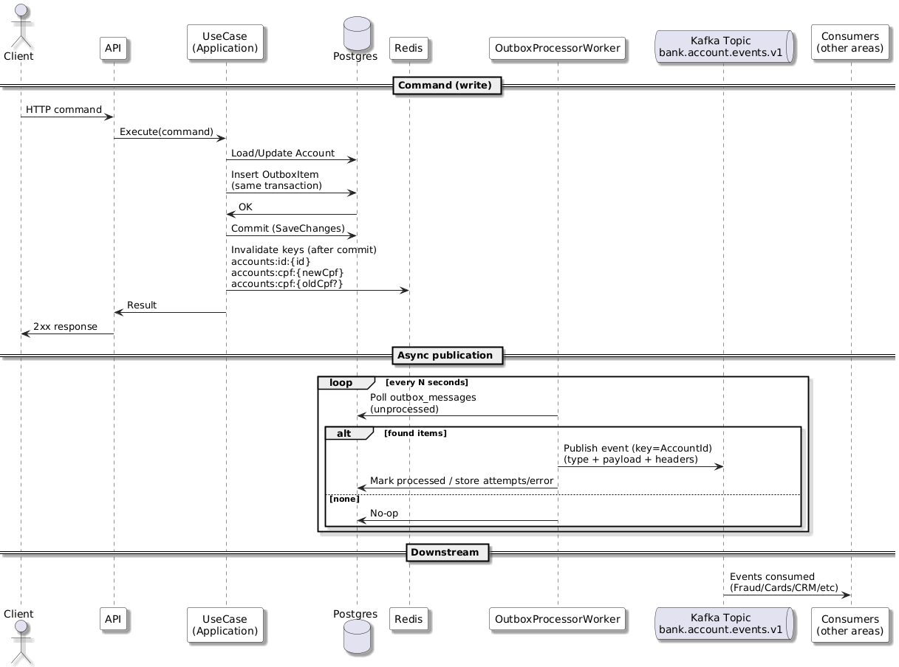
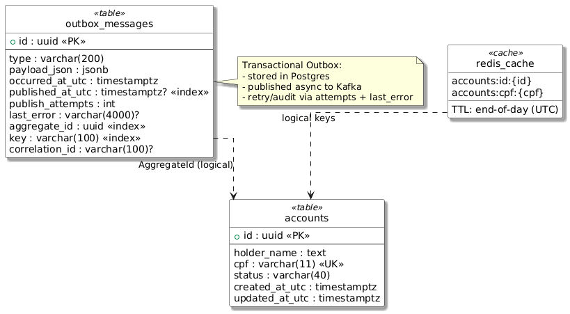
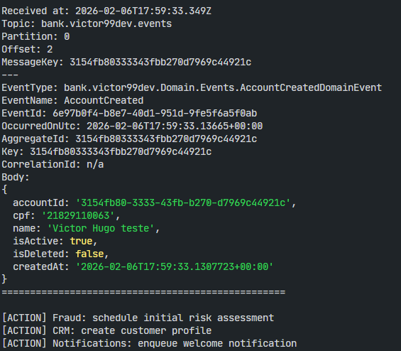
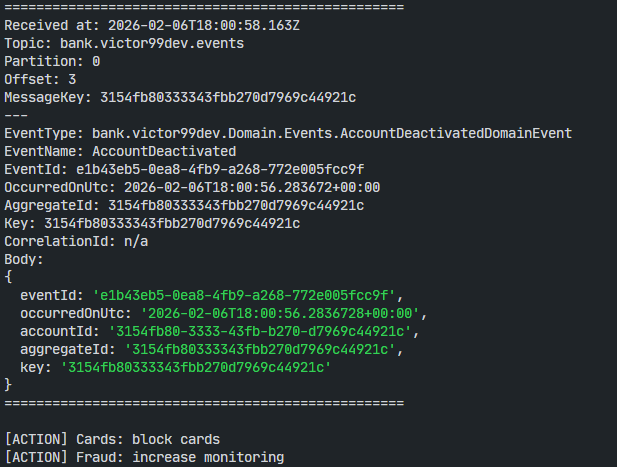
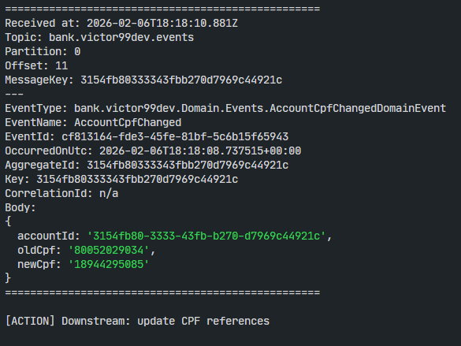
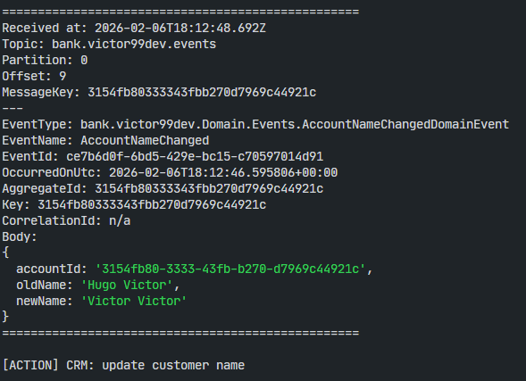

# Accounts & Events API

## Construindo uma API de Contas orientada a eventos

Este projeto implementa uma **Accounts API** inspirada em cenários reais de sistemas bancários modernos e de alta criticidade.

Ele foi concebido como **um teste técnico para um banco**, adotando práticas e padrões que normalmente só aparecem em sistemas corporativos de produção, onde confiabilidade, consistência, observabilidade e desacoplamento entre domínios são requisitos fundamentais.

Mais do que um simples CRUD, o projeto busca demonstrar na prática:

* Como modelar um **domínio rico com DDD (Domain-Driven Design)**,
* Como garantir **confiabilidade na comunicação assíncrona usando o Outbox Pattern**,
* Como reduzir custo operacional e latência com **cache inteligente em Redis**,
* Como promover **desacoplamento entre áreas de negócio via Kafka e arquitetura orientada a eventos**,
* E como organizar tudo isso dentro de uma **Clean Architecture alinhada aos princípios SOLID**.

Na prática, este serviço representa o **core de um sistema de contas bancárias**, atuando como fonte de verdade para o domínio *Account* e emitindo eventos que podem ser consumidos por diversas áreas da organização, tais como:

* **Fraude** — monitoramento e prevenção de riscos,
* **Cartões** — atualização de status e relacionamento com contas,
* **CRM** — visão centralizada do cliente,
* **Notificações** — comunicação proativa com usuários,
* **Open Finance** — compartilhamento seguro de dados,
* **Analytics** — construção de métricas e insights,
* **Backoffice** — operações administrativas e auditoria.

O desenho atende diretamente aos dois problemas centrais do teste
técnico:

1)  **Integração entre áreas do banco**: múltiplos domínios, reagem a mudanças no ciclo de vida da conta por meio de eventos assíncronos.

2)  **Redução de custo com consultas repetidas ao banco**: uso de Redis como cache distribuído com TTL diário e invalidação consistente pós-commit.

Todas essas áreas podem **reagir aos eventos publicados por este serviço**, sem acoplamento direto, garantindo autonomia dos times e escalabilidade do ecossistema.

### Principais pilares técnicos

* **Clean Architecture + SOLID**
* **DDD com Domain Events explícitos**
* **Transactional Outbox Pattern para confiabilidade**
* **Kafka como backbone de eventos entre áreas**
* **Redis com cache diário e invalidação consistente**
* **EF Core + PostgreSQL como persistência principal**
* **Observabilidade básica (logs estruturados) e injeção de dependência bem definida**

---

## Tecnologias

* **.NET 8**
* **Entity Framework Core 8**
* **PostgreSQL (Npgsql)**
* **Confluent.Kafka**
* **Redis (StackExchange.Redis)**
* **Swagger / OpenAPI**
* **xUnit**

---

## Arquitetura Geral



### Resumo do desenho

Este diagrama apresenta a **visão estrutural da solução em camadas**, baseada em Clean Architecture e no princípio de separação de responsabilidades.

**Domain**  
Contém o núcleo do negócio e representa a fonte de verdade conceitual do sistema.  
Inclui o agregado `Account`, o Value Object `Cpf` e **Domain Events explícitos**, que materializam fatos relevantes do negócio.  
A interface `IHasAggregateKey` garante que todo evento carregue uma chave de particionamento estável para Kafka, preservando ordem e coerência por conta.

**Application**  
Atua como orquestrador de casos de uso, coordenando regras de negócio, repositórios, Unit of Work e cache.  
O `DomainEventDispatcher` transforma eventos de domínio em itens de Outbox de forma padronizada, desacoplando o domínio de qualquer tecnologia de mensageria.  
A camada define **ports (interfaces)** para persistência, cache e mensageria, mantendo dependências invertidas.

**Infrastructure**  
Concentra todas as integrações externas:  
- EF Core + PostgreSQL para persistência transacional,  
- Redis como cache distribuído e compartilhado entre instâncias,  
- Kafka Producer para publicação de eventos,  
- **OutboxProcessorWorker** responsável por garantir entrega assíncrona e resiliente dos eventos.  

O conjunto assegura que o domínio permaneça puro, enquanto decisões técnicas ficam isoladas na infraestrutura.

---

## Fluxo de Escrita



Este diagrama detalha o **caminho crítico de gravação** e como o sistema garante consistência entre banco de dados e eventos.

Em qualquer operação que altere o estado de `Account`:

1. O UseCase carrega o agregado quando necessário.  
2. A mutação é aplicada dentro do domínio, respeitando invariantes de negócio.  
3. Um **Domain Event** é criado para representar o fato ocorrido.  
4. O `DomainEventDispatcher` serializa o evento e grava um registro na tabela `outbox_messages`.  
5. `SaveChangesAsync()` persiste **Account e Outbox na mesma transação atômica**, evitando inconsistências.  
6. Somente após o commit bem-sucedido, o cache Redis é invalidado para prevenir leitura de dados obsoletos.
7.  O cache Redis é invalidado após commit.

Estratégia de invalidação:
- `accounts:id:{id}`  
- `accounts:cpf:{newCpf}`  
- `accounts:cpf:{oldCpf}` *(quando há mudança de CPF)* 

### Chaves de cache:

    accounts:id:{accountId}
    accounts:cpf:{cpf}

Sempre que há alteração no agregado `Account`, o cache correspondente é **invalidado imediatamente após o commit transacional**.

No caso específico de mudança de CPF, são invalidadas **duas entradas**:

* a chave associada ao **CPF antigo**.
* a chave associada ao **CPF novo**.

Isso evita qualquer possibilidade de leitura de dados inconsistentes ou divergentes entre banco e cache.

Na próxima requisição de leitura, o dado é novamente materializado no Redis a partir do PostgreSQL e armazenado com **TTL diário**, garantindo que o cache esteja sempre sincronizado com a fonte de verdade, mas sem gerar carga desnecessária no banco ao longo do dia.

---

## Fluxo Ponta a Ponta



Este diagrama ilustra o **ciclo completo do evento**, separando claramente responsabilidade síncrona e assíncrona.

### Camada síncrona (rápida e previsível)
- A requisição HTTP é processada pela API.  
- Dados e Outbox são gravados no banco em uma única transação.  
- A API retorna sucesso imediatamente ao cliente.

### Camada assíncrona (confiável e resiliente)
O **OutboxProcessorWorker** executa periodicamente:

1. Busca eventos não publicados em `outbox_messages`.  
2. Publica no tópico `bank.account.events.v1`.  
3. Em caso de sucesso, marca o evento como publicado.  
4. Em caso de falha, registra erro e realiza novas tentativas automaticamente.

Outras áreas consomem o tópico e reagem aos eventos, sem dependência direta deste serviço, caracterizando uma arquitetura verdadeiramente orientada a eventos.

---


## Fluxo Assíncrono

O **OutboxProcessorWorker** executa periodicamente:

1.  Busca eventos não publicados;
2.  Publica no tópico `bank.account.events.v1`;
3.  Marca como publicado em caso de sucesso;
4.  Realiza retries automáticos em caso de falha.

Kafka usa **Key = AccountId**, garantindo ordem por agregado.

---

## Modelo de Dados



**accounts**  
É a **fonte de verdade do domínio**, contendo os dados centrais da conta.

**outbox_messages**  
Implementa o padrão Outbox com campos como tipo do evento, payload serializado, timestamp, número de tentativas e erros, permitindo reprocesso, auditoria e rastreabilidade.

**Redis (cache lógico)**  
Armazena respostas frequentes com TTL diário:
```
accounts:id:{accountId}
accounts:cpf:{cpf}
```

Reduz custo de leitura no banco e melhora performance sem comprometer consistência.

---

## Eventos de Domínio Emitidos

Este serviço atua como **produtor canônico de eventos do agregado `Account`**, materializando mudanças relevantes do domínio por meio de **Domain Events explícitos**. Esses eventos representam fatos consumados do negócio e são publicados de forma confiável via **Outbox + Kafka**, garantindo ordem, rastreabilidade e reprocesso quando necessário.

Eventos emitidos:

* `AccountCreatedDomainEvent`
* `AccountDeactivatedDomainEvent`
* `AccountActivatedDomainEvent`
* `AccountDeletedDomainEvent`
* `AccountRestoredDomainEvent`
* `AccountUpdatedDomainEvent`
* `AccountNameChangedDomainEvent`
* `AccountCpfChangedDomainEvent`

Cada evento carrega a **chave de agregação (`AccountId`) como Kafka Key**, preservando ordenação por conta e permitindo que consumidores reconstruam estado ou realizem projeções consistentes.

### Consumo por domínios downstream

Diferentes áreas do banco **reagem de forma assíncrona e desacoplada** a esses eventos, por exemplo:

* **Fraude:** inicia ou ajusta monitoramento de risco;
* **Cartões:** bloqueia, suspende ou habilita emissão de cartões;
* **CRM:** mantém a visão centralizada e atualizada do cliente;
* **Notificações:** dispara comunicações proativas ao usuário;
* **Analytics:** alimenta métricas, indicadores e painéis analíticos.

Nenhuma dessas integrações ocorre dentro da requisição HTTP, todos os efeitos sistêmicos são processados **fora do caminho crítico**, via Kafka.

### Evidências práticas de funcionamento

Os prints abaixo demonstram, na prática, que os eventos são efetivamente produzidos e que outras áreas reagem automaticamente a eles (Fraude, Cartões, CRM e Analytics), confirmando o fluxo ponta a ponta da arquitetura orientada a eventos:

> **Observação de segurança e privacidade:**
> Os CPFs utilizados nos exemplos **não são dados reais de pessoas**. Foram gerados exclusivamente para testes e demonstração técnica por meio da ferramenta pública:
> [4devs.com](https://www.4devs.com.br/gerador_de_cpf)
>
> Isso evita qualquer exposição de dados pessoais sensíveis e mantém o projeto alinhado a boas práticas de proteção de dados.

<div align="center">
  
  
</div>

<div align="center">
  
  
</div>

---

### Consumer de validação

Além dos logs do serviço e das evidências acima, eu disponibilizei um repositório separado usado para **testar o consumo dos eventos publicados no Kafka**.
Ele funciona como um **consumer de referência**, garantindo que os eventos emitidos pelo tópico possam ser lidos, desserializados e processados por serviços externos (simulando domínios downstream).

Repositório:

* [producer-and-consumer-kafka-message](https://github.com/victor99dev/producer-and-consumer-kafka-message)

Esse consumer foi utilizado para validar:

* Conectividade com o broker Kafka;
* Consumo contínuo do tópico;
* Leitura por **partition** com **Key = AccountId** (ordem por agregado);
* Desserialização do payload e inspeção do conteúdo do evento;
* Confirmação prática de que o ecossistema consegue reagir aos eventos sem dependência direta da API.

---

## Comandos
| Comando | Descrição |
|--------|-----------|
| `dotnet clean` | Remove artefatos de build (pastas bin/ e obj/) |
| `dotnet restore` | Restaura pacotes NuGet |
| `dotnet build` | Compila a solução |
| `dotnet test` | Executa todos os testes automatizados |
| `dotnet test /p:CollectCoverage=true /p:CoverletOutputFormat=cobertura` | Executa testes e gera relatório de cobertura em XML |
| `dotnet run --project src/bank.victor99dev.Api` | Inicia a API localmente |
| `dotnet ef migrations add NomeMigracao -p src/bank.victor99dev.Infrastructure -s src/bank.victor99dev.Api` | Cria uma migration |
| `dotnet ef database update -p src/bank.victor99dev.Infrastructure -s src/bank.victor99dev.Api` | Aplica migrations |
| `docker compose up -d --build` | Executa API + Postgres + Redis + Kafka |
| `docker compose stop` | Para todos os containers (mantém dados) |
| `docker compose down` | Para e remove containers (mantém volumes) |
| `docker compose down -v` | Para e remove containers e apaga volumes |


> Para testar a aplicação com todas as dependências, basta executar: `docker compose up -d --build`.

---

## Acessando a API
- Swagger: `http://localhost:{PORT}/swagger`  
- Use Postman ou Insomnia  

---

## Endpoints

> Base URL: `/api/accounts`

<details><summary><b>Accounts Endpoints</b></summary>
<p>

| Verbo | Endpoint | Parâmetro | Body |
|------:|----------|-----------|------|
| POST | `/api/accounts` | N/A | `CreateAccountRequest` |
| GET | `/api/accounts/{accountId}` | `accountId` | N/A |
| GET | `/api/accounts` | query | N/A |
| GET | `/api/accounts/{cpf}/cpf` | `cpf` | N/A |
| PUT | `/api/accounts/{accountId}` | `accountId` | `UpdateAccountRequest` |
| PATCH | `/api/accounts/{accountId}/name` | `accountId` | `ChangeAccountNameRequest` |
| PATCH | `/api/accounts/{accountId}/cpf` | `accountId` | `ChangeAccountCpfRequest` |
| PATCH | `/api/accounts/{accountId}/activate` | `accountId` | N/A |
| PATCH | `/api/accounts/{accountId}/deactivate` | `accountId` | N/A |
| PATCH | `/api/accounts/{accountId}/restore` | `accountId` | N/A |
| DELETE | `/api/accounts/{accountId}` | `accountId` | N/A |

</p>
</details>

### Exemplos de payload

<details><summary><b>CreateAccountRequest</b></summary>
<p>

```json
{
  "name": "Victor Hugo",
  "cpf": "12345678901"
}
```
</p>
</details>

<details><summary><b>UpdateAccountRequest</b></summary>
<p>

```json
{
  "name": "Victor Hugo",
  "cpf": "12345678901",
  "isActive": true,
  "isDeleted": false
}
```
</p>
</details>

<details><summary><b>ChangeAccountNameRequest</b></summary>
<p>

```json
{
  "name": "Novo Nome"
}
```
</p>
</details>

<details><summary><b>ChangeAccountCpfRequest</b></summary>
<p>

```json
{
  "cpf": "10987654321"
}
```
</p>
</details>

Os endpoints cobrem todo o ciclo de vida do agregado **Account**, incluindo operações de criação, leitura, atualização de dados e mudanças de estado.

---

## Estrutura do Projeto

```
src/
  bank.victor99dev.Api
  bank.victor99dev.Application
  bank.victor99dev.Domain
  bank.victor99dev.Infrastructure
tests/
  bank.victor99dev.Tests.Application
  bank.victor99dev.Tests.Domain
  bank.victor99dev.Tests.Infrastructure
```

---

## O que este projeto demonstra

* **CRUD completo com controllers finos**, atuando apenas como adaptadores HTTP;
* **DDD aplicado de forma concreta**, com agregado `Account`, Value Object `Cpf` e validações/invariantes dentro do domínio;
* **Domain Events puros**, sem dependência de infraestrutura na camada Domain;
* **Transactional Outbox Pattern**, garantindo consistência atômica entre **estado do banco e registro do evento**;
* **Entrega assíncrona e resiliente de eventos** via `OutboxProcessorWorker`, com retry, idempotência operacional e rastreabilidade;
* **Kafka como backbone de integração**, usando `Key = AccountId` para preservar ordenação por agregado e evitar condições de corrida entre consumidores;
* **Desacoplamento entre domínios de negócio**, permitindo evolução independente de Fraude, Cartões, CRM, Notificações e Analytics;
* **Redis como cache distribuído com TTL diário**, reduzindo custo em nuvem e latência de leitura;
* **Invalidação determinística de cache pós-commit**, incluindo invalidação do CPF antigo e novo em mudanças cadastrais;
* **Separação clara entre consistência transacional (banco + outbox) e consistência eventual (eventos downstream)**;
* **Arquitetura preparada para escala organizacional**, não apenas técnica.

> O projeto demonstra como transformar um simples CRUD em um **serviço canônico orientado a eventos**, capaz de operar como fonte de verdade em um ecossistema real de microsserviços bancários, equilibrando consistência, custo e desacoplamento.

---

## Meus Links

* GitHub: https://github.com/torugo99  
* LinkedIn: https://www.linkedin.com/in/victor-hugo99/  
* Site: https://victor99dev.website/  

---

### Créditos e Agradecimentos
* Documentação oficial .NET: https://learn.microsoft.com/pt-br/dotnet/  
* Swagger / OpenAPI: https://learn.microsoft.com/pt-br/aspnet/core/tutorials/getting-started-with-swashbuckle  
* PostgreSQL: https://www.postgresql.org/  
* Redis: https://redis.io/  
* Kafka (conceitos): https://kafka.apache.org/documentation/  
